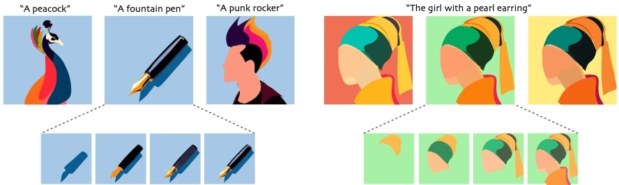
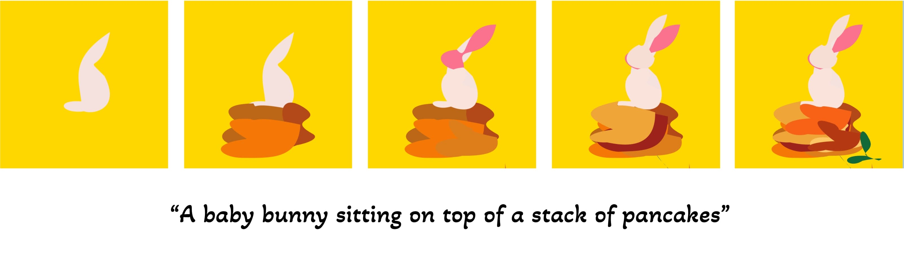
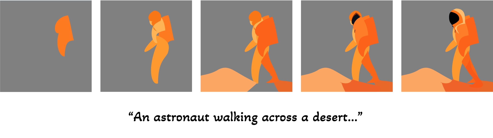
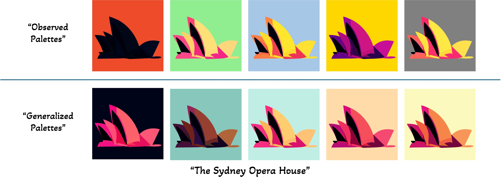
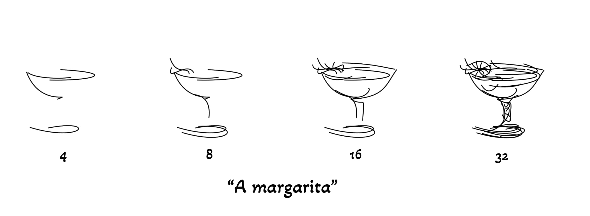

# NeuralSVG: An Implicit Representation for Text-to-Vector Generation

<p align="center">

</p>

*NeuralSVG generates vector graphics from text prompts with ordered and editable shapes. Our method supports dynamic conditioning, such as background color, which facilitating the generation of multiple color palettes for a single learned representation.*


#### Sagi Polaczek, Yuval Alaluf, Elad Richardson, Yael Vinker, Daniel Cohen-Or  

> Vector graphics are essential in design, providing artists with a versatile medium for creating resolution-independent and highly editable visual content. Recent advancements in vision-language and diffusion models have fueled interest in text-to-vector graphics generation. However, existing approaches often suffer from over-parameterized outputs or treat the layered structure --- a core feature of vector graphics --- as a secondary goal, diminishing their practical use. Recognizing the importance of layered SVG representations, we propose NeuralSVG, an implicit neural representation for generating vector graphics from text prompts. Inspired by Neural Radiance Fields (NeRFs), NeuralSVG encodes the entire scene into the weights of a small MLP network, optimized using Score Distillation Sampling (SDS). To encourage a layered structure in the generated SVG, we introduce a dropout-based regularization technique that strengthens the standalone meaning of each shape. We additionally demonstrate that utilizing a neural representation provides an added benefit of inference-time control, enabling users to dynamically adapt the generated SVG based on user-provided inputs, all with a single learned representation. Through extensive qualitative and quantitative evaluations, we demonstrate that NeuralSVG outperforms existing methods in generating structured and flexible SVG.

<a href="TBD"></a>
<a href="https://sagipolaczek.github.io/NeuralSVG/"></a> 


# Description
Official implementation of our NeuralSVG paper.

# Code Coming Soon!
<p align="center">
  
<br>
<p align="center">
  
<br>
<p align="center">
  
<br>
<p align="center">
  
<br>
<p align="center">
  
<br>
<p align="center">
  
<br>

# Citation
If you find this code useful for your research, please consider citing us:

```
TBD
```